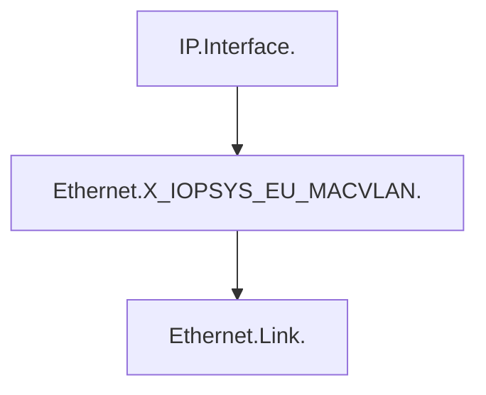
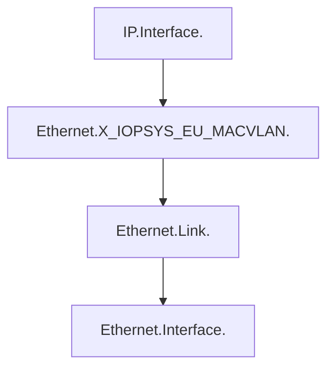
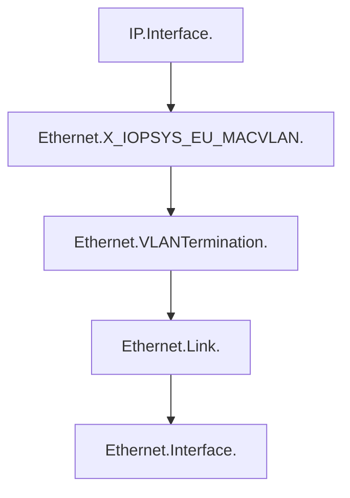

# MACVLAN
The MACVLAN driver is the newest built-in network driver and offers several unique characteristics. It's a very lightweight driver, because rather than using any Linux bridging or port mapping, it connects container interfaces directly to host interfaces.

## Deployment Scenario
Historically MACVLAN used in iowrt devices to support One Vlan per customer scenario, where MACVLAN devices created over tagged wan interface, one MACVLAN device for a specific service type.

## Current Issues
With vlanconf deprecation, uci option vid no longger available for device sections with type MACVLAN, so the current datamodel implementation needs to be updated.
Also the current datamodel implementation is bit complex and caused us several bugs and open corner cases.

## Proposal for MACVLAN
With linux MACVLAN driver, it is possible to create MACVLAN device over untagged interfaces or tagged interface

### UCI for MACVLAN over untagged interface
```bash
config device 'mv1'
    option type 'macvlan'
    option ifname 'eth4'
    option name 'eth4_1'

config device 'mv2'
    option type 'macvlan'
    option ifname 'eth4'
    option name 'eth4_2'

config interface 'wan1'
    option device 'eth4_1'
    option proto 'dhcp'

config interface 'wan2'
    option device 'eth4_2'
    option proto 'dhcp'
```

### UCI for MACVLAN over tagged wan interface
```bash
config device 'tagged_wan'
    option type '8021q'
    option ifname 'eth4'
    option name 'eth4.100'
    option vid '100'

config device 'mv1'
    option type 'macvlan'
    option ifname 'eth4.100'
    option name 'eth4_1'
    
config device 'mv2'
    option type 'macvlan'
    option ifname 'eth4.100'
    option name 'eth4_2'
    
config interface 'service1'
    option proto 'dhcp'
    option ifname 'eth4_1'
    
config interface 'service2'
    option proto 'dhcp'
    option device 'eth4_2'
```

## Datamodel Proposal
Although MACVLAN share some similarities with an Ethernet Link object, but it can't be mapped to the Ethernet.Link, as MACVLAN has to be over vlan termination which creates a cyclic dependency.

Statndart TR181 datamodel does not include MACVLAN in datamodel, but it has a provision to define vendor specific datamodel interface as described in "4.2.4 Vendor-specific Interface Objects" chapter of TR181.

To simplify the interface stacking, proposal is to introduce a new vendor specific interface layer between IP.Interface and Ethernet.Link, as below



It could be possible to create a MACVLAN interface on tagged and untagged interfaces, which could be done as below:

### Datamodel for MACVLAN over untagged interface


### Datamodel for MACVLAN over Tagged interface


#### Datamodel parameter proposal
Since this new vendor extention is an interface object, so proposal is to have similar parameter set as on an interface object for it, which is as below:
```bash
Device.Ethernet.X_IOPSYS_EU_MACVLAN.{i}.Enable
Device.Ethernet.X_IOPSYS_EU_MACVLAN.{i}.Status
Device.Ethernet.X_IOPSYS_EU_MACVLAN.{i}.Alias
Device.Ethernet.X_IOPSYS_EU_MACVLAN.{i}.Name
Device.Ethernet.X_IOPSYS_EU_MACVLAN.{i}.LowerLayers
Device.Ethernet.X_IOPSYS_EU_MACVLAN.{i}.MACAddress
Device.Ethernet.X_IOPSYS_EU_MACVLAN.{i}.Stats.BytesSent
Device.Ethernet.X_IOPSYS_EU_MACVLAN.{i}.Stats.BytesReceived
Device.Ethernet.X_IOPSYS_EU_MACVLAN.{i}.Stats.PacketsSent
Device.Ethernet.X_IOPSYS_EU_MACVLAN.{i}.Stats.PacketsReceived
Device.Ethernet.X_IOPSYS_EU_MACVLAN.{i}.Stats.ErrorsSent
Device.Ethernet.X_IOPSYS_EU_MACVLAN.{i}.Stats.ErrorsReceived
Device.Ethernet.X_IOPSYS_EU_MACVLAN.{i}.Stats.DiscardPacketsSent
Device.Ethernet.X_IOPSYS_EU_MACVLAN.{i}.Stats.DiscardPacketsReceived
```
